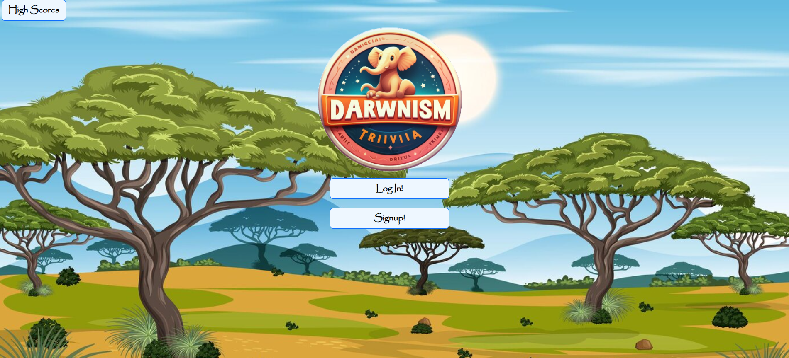
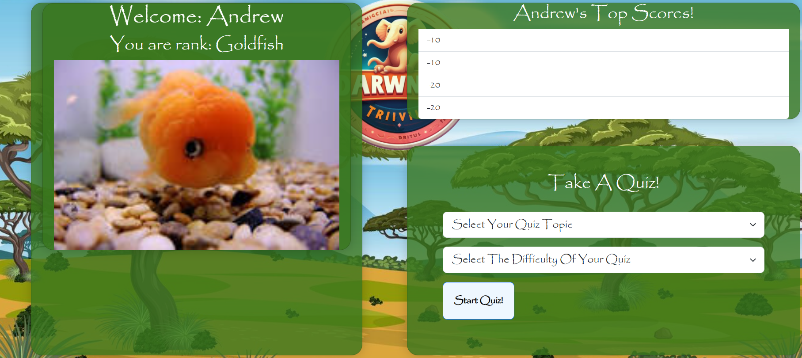

# Darwnism

## Description

Welcome to Darwnism, an engaging trivia game that tests your knowledge across various subjects! Dive into a fun and interactive quiz experience that challenges you to explore history, geography, science, sports, entertainment, and more. Not only can you showcase your expertise, but you can also track your progress and compete with friends for the highest rank.

#### [Visit the Deployed Site](https://darwnism-d5883c9cdeb6.herokuapp.com/)

## User Stories

As a user, I want to:

- Easily log in or sign up to access Darwnism's captivating trivia.
- Personalize my quiz by choosing specific topics and difficulty levels.
- Track my quiz performance and view my highest score for each attempt.
- Compare my highest score against other players to gauge my standing.
- Receive a unique animal assignment based on my quiz score.

 

<h2 align="center">
<em>Landing Page and Dashboard</em>
</h2>

    
    

## Features

- **Scoring and Progress Tracking:** Keep track of your quiz score, correct answers, and earned points to monitor your progress.
- **Animal Assignment:** Receive a distinctive animal based on your score, with higher scores unlocking more exotic and intelligent animals.
- **Vast Database:** Access a regularly updated database of questions from diverse sources to ensure a fresh and relevant trivia experience.
- **Intuitive Interface:** Enjoy an easy-to-use interface, customize quizzes effortlessly, and select topics and difficulty levels seamlessly.

 

<h3 style="margin-left: 100px">
<em>Login & Signup Page and Quiz Question Block</em>
</h3>

    
    

## Usage

1. **Login or Signup:** Access the website and create an account for full access.
2. **Dashboard:** Navigate to your dashboard to view your status or start a new quiz.
3. **Quiz Experience:** Engage in the quiz, track your score, and receive your unique animal assignment based on your performance.
4. **Retry or Navigate:** Retry the quiz, return to the dashboard to start anew, or view high scores to compare your standing.

___
 

<h3><em>Demo<em></h3>

 

Technology Used         | Resource URL           |
| ------------- |:-------------:|
| Node.js    | [https://nodejs.org/en/docs](https://nodejs.org/en/docs)  |
| Express    | [http://expressjs.com/en/starter/installing.html](http://expressjs.com/en/starter/installing.html)  |
| Express-Handlebars       | [https://www.npmjs.com/package/express-handlebars](https://www.npmjs.com/package/express-handlebars) |
| Express-Session     | [https://www.npmjs.com/package/express-session](https://www.npmjs.com/package/express-session)  |
| Path     | [https://nodejs.org/api/path.html](https://nodejs.org/api/path.html)  |
| MySQL     | [https://dev.mysql.com/doc/](https://dev.mysql.com/doc/)  |
| Sequelize    | [https://sequelize.org/docs/v6/getting-started/](https://sequelize.org/docs/v6/getting-started/)  |
| Connect-Session-Sequelize    | [https://www.npmjs.com/package/connect-session-sequelize](https://www.npmjs.com/package/connect-session-sequelize)  |
| Dotenv     | [https://www.npmjs.com/package/dotenv](https://www.npmjs.com/package/dotenv)  |
| Bcrypt    | [https://www.npmjs.com/package/bcrypt](https://www.npmjs.com/package/bcrypt)  |
| Session     | [https://www.section.io/engineering-education/session-management-in-nodejs-using-expressjs-and-express-session/](https://www.section.io/engineering-education/session-management-in-nodejs-using-expressjs-and-express-session/)  |
| CSS        | [https://developer.mozilla.org/en-US/docs/Web/CSS](https://developer.mozilla.org/en-US/docs/Web/CSS)      |
| Git        | [https://git-scm.com/](https://git-scm.com/)     |
| JavaScript | [https://developer.mozilla.org/en-US/docs/Web/JavaScript](https://developer.mozilla.org/en-US/docs/Web/JavaScript) |

## Bootstrap

Darwnism's UI is built using Bootstrap, a user-friendly CSS framework. Bootstrap allows for quick layout setup, which can be further customized using CSS for a polished appearance.

[Bootstrap Documentation](https://getbootstrap.com/docs/5.0/getting-started/introduction/)

## Credits

- Andi Petersen ([GitHub Profile](https://github.com/Antedbell20))
- Jack Seymour ([GitHub Profile](https://github.com/JackLCmore))
- Ian Sills ([GitHub Profile](https://github.com/Ian-kensington-chadwick-the-3rd))
- Andrew Hall ([GitHub Profile](https://github.com/Andrewchall92))

## License

This project is licensed under the [MIT License](LICENSE) 
